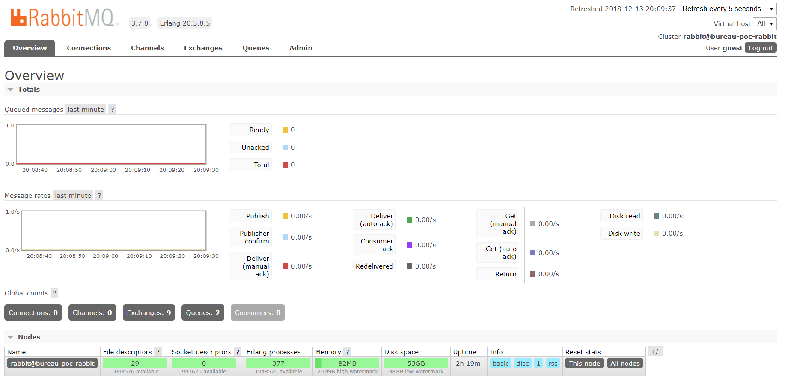
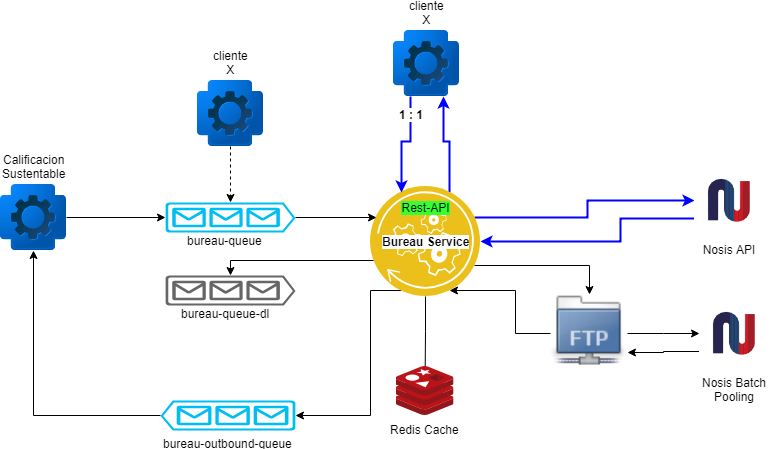

# Bureau Service

Microservicio que orquesta y gestiona las operacions relacionadas con las consultas a los bureaus crediticios de los usuarios.

## Empezando
Clonar el repositorio.  
```sh
git clone https://github.com/HernanUrban/bureau-poc.git
```
Compilacion del proyecto  
```sh 
./mvnw clean package
```  
El POC consta de dos servicios. Uno de ellos *bureau-publisher* es para publicar mensajes que seran procesados por el *bureau-service*.
```sh
$ cd bureau-publisher/target
$ java -jar bureau-publisher-0.0.1-SNAPSHOT.jar

$ cd bureau-service/target
$ java -jar bureau-service-0.0.1-SNAPSHOT.jar

```
Publicar mensaje  
```sh
$ curl --header "Content-Type: application/json" \
  --request POST \
  --data '{"id": "3d7acfc2-ff58-11e8-8eb2-f2801f1b9fd1","cuit":"20341251220", "payload" : {"var1" : "someValue","var2" : "someValue2"}}' \
  http://localhost:8080/bureau/sendMessage
```
En la consola de *bureau-service* se vera que el mensaje ha sido procesado:
```console
Handling bureau message - id: 3d7acfc2-ff58-11e8-8eb2-f2801f1b9fd1, cuit: 20341251220, payload: {var1=someValue, var2=someValue2}
Accessing Nosis for id: 3d7acfc2-ff58-11e8-8eb2-f2801f1b9fd1, cuit: 20341251220
```
Si se emite un segundo llamado para el mismo request dentro de los primeros 10 segs (ver ttl en application.properties), la informacion sera obtenida desde Redis (cache). Por lo que en el log no vera el mensaje de acceso a Nosis:
```console
Handling bureau message - id: 3d7acfc2-ff58-11e8-8eb2-f2801f1b9fd1, cuit: 20341251220, payload: {var1=someValue, var2=someValue2}
```

### Prerequisitos

1. RabbitMQ
Instalar imagen docker:

```sh
docker run -d --hostname bureau-poc-rabbit --name bureau-poc-rabbit -p 8585:15672 -p 5672:5672 rabbitmq:3-management
```  
Si el puerto 8585 esta en uso cambiar por algun puerto libre: `-p 8585:15672`  
El plugin quedara accesible en `http://localhost:8585` _(user: guest, pass: guest)_



2. Redis
Instalar imagen docker:

```sh
docker run --name bureau-redis -p 6379:6379 -d redis
```


### Arquitectura  

