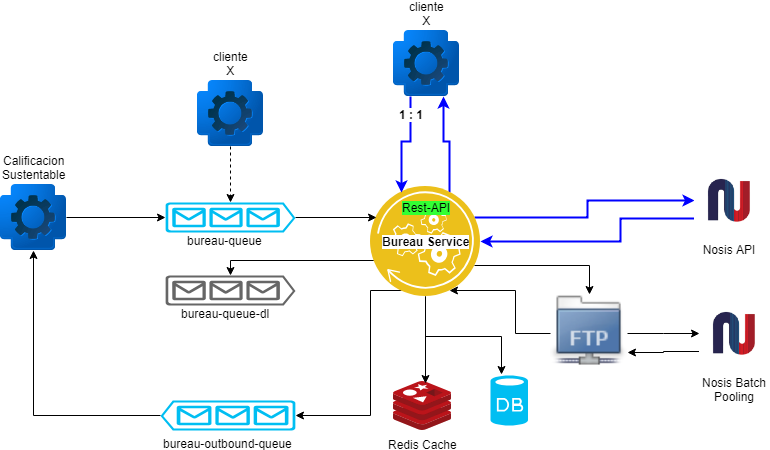

# Bureau Service

Microservicio que orquesta y gestiona las operacions relacionadas con las consultas a los bureaus crediticios de los usuarios.

## Empezando
Clonar el repositorio.  
```  
git clone https://github.com/HernanUrban/bureau-poc.git
```
Compilacion del proyecto  
``` 
./mvnw clean package
```


### Prerequisitos

1. Instalar rabbitmq (docker image)

```
docker run -d --hostname bureau-poc-rabbit --name bureau-poc-rabbit -p 8585:15672 -p 5672:5672 rabbitmq:3-management
```  
Si el puerto 8585 esta en uso cambiar por algun puerto libre: `-p 8585:15672`  
El plugin quedara accesible en `http://localhost:8585` (user: guest, pass: guest)


### Arquitectura  

